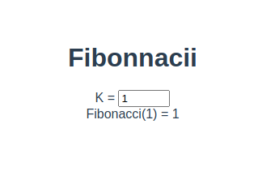
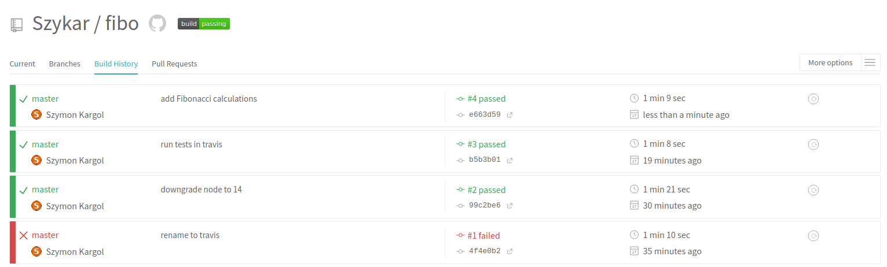

# Fibonnacci

*Autor: Szymon Kargol*



Podgląd na żywo: https://szykar.github.io/fibo/

## Opis rozwiązania

Wykonano aplikację obliczającą wartość liczby K z ciągu Fibonnacciego z wykorzystaniem frameworka Vue.js.

## Zautomatyzowany proces wdrożenia

Zmiany wprowadzane do repozytorium (push/merge) wyzwalają skrypt Travisa:

* Travis uruchamia testy
* jeśli testy przejdą pomyślnie, Travis wdraża automatycznie kod aplikacji na serwer GitHub pages

### Opis konfiguracji Travis

```yml
language: node_js
node_js:
  - '14' # użycie nodejs 14
cache:
  yarn: true # cache zależności yarn
  directories:
    - public
    - .cache

script:
  - yarn test:unit # uruchomienie testów

after_success:
  - yarn build # gdy testy przejdą pomyślnie, yarn kompiluje JS

deploy:
  provider: pages # deploy to GitHub Pages
  github-token: $GITHUB_TOKEN # token github
  skip-cleanup: true 
  local_dir: dist # katalog zbudowanego kodu
  keep-history: true 
  target_branch: gh-pages # branch którego używa github pages
  on:
    branch: master # deploy uruchamiany jest tylko na branchu master, czyli na przykład po zmergowaniu pull requesta
```


## Podgląd buildów travisa


